# Knowledge Graph

FEG Pulse models users, their interests, their surfaces and their compliance
state as a single in-memory knowledge graph. The graph is the source of truth
for two questions the Moment Router must answer for every event:

1. Is this user structurally eligible for the surface this moment wants?
2. Are inducements blocked for this user by construction?

The Rust gateway builds the graph with `petgraph` (`services/gateway-rs/src/graph/knowledge_graph.rs`)
and exposes it as JSON and Mermaid.

## Entities

| Node kind      | Examples                                             |
| -------------- | ---------------------------------------------------- |
| User           | Marek, Tomas, Eva, Jakub                             |
| Team           | GNK Dinamo, HNK Hajduk, HNK Rijeka, NK Osijek        |
| Ticket         | open / cashout-available bet slips                   |
| Slot           | Sweet Bonanza, Wanted Dead or a Wild                 |
| Tournament     | Daily Kokice Cup, Weekend Jackpot Klasik             |
| Table          | Hrvatski Auto Rulet, Blackjack VIP                   |
| Bonus          | Dobrodosli bonus, Reload petak                       |
| Surface        | Watch, Widget, Quick action, Live Activity, Dynamic Island |
| ConsentState   | Personalisation ON / OFF                             |
| RgState        | Clear, Self-excluded, Deposit limit reached, High risk |

## Relationships

`follows`, `has_ticket`, `favorite_slot`, `followed_tournament`, `plays_table`,
`has_consent_state`, `has_rg_state`, `eligible_for_surface`, `inducements_blocked_by`.

`eligible_for_surface` edges are only drawn to the silent surfaces a user has
actually consented to (account verified, personalisation on, TCF purpose consent
on, per-surface toggle on). `inducements_blocked_by` links a user to the RG state
that removes the inducement class for them. Together these two edge types are what
the Moment Router reads to decide where a moment may land and whether an inducement
may exist at all.

## How it drives routing and compliance

- The router proposes a surface per event kind; the graph's `eligible_for_surface`
  edges confirm the surface can exist for that user before the Care Gate runs.
- The Care Gate is the enforcement kernel; the graph is the explanation layer.
  Because `inducements_blocked_by` is derived from the same RG/consent fields the
  Care Gate reads, the graph and the gate can never disagree.
- Pull-not-push falls straight out of the model: a user only has `follows`,
  `favorite_slot`, `followed_tournament` and `plays_table` edges to things they
  chose, so no server-side segmentation can attach a surface to an interest the
  user never selected.

## Export

- JSON: `GET /api/graph` (nodes, edges, counts).
- Mermaid: `GET /api/graph?format=mermaid`, or `cargo run -p feg-pulse-gateway graph`,
  or `make graph`. The seed graph is 26 nodes and 41 edges.

## Seed graph (generated)

```mermaid
graph LR
  surface_watch["Watch complication"]
  surface_widget["Widget"]
  surface_quick_action["Quick action"]
  surface_live_activity["Live Activity"]
  surface_dynamic_island["Dynamic Island"]
  user_marek(["Marek"])
  consent_Personalisation_ON{"Personalisation ON"}
  rg_Clear{"Clear"}
  team_dinamo("GNK Dinamo")
  ticket_tkt_marek_dinamo("GNK Dinamo to win vs Hajduk")
  slot_slot_bonanza("Sweet Bonanza")
  slot_slot_wanted("Wanted Dead or a Wild")
  tournament_tourn_daily_kok("Daily Kokice Cup")
  table_table_hr_roulette("Hrvatski Auto Rulet")
  user_tomas(["Tomáš"])
  rg_Deposit_limit_reached{"Deposit limit reached"}
  team_hajduk("HNK Hajduk")
  ticket_tkt_tomas_hajduk("HNK Hajduk to win vs Dinamo")
  slot_slot_gates("Gates of Olympus")
  user_eva(["Eva"])
  rg_Self_excluded{"Self-excluded"}
  team_rijeka("HNK Rijeka")
  ticket_tkt_eva_rijeka("HNK Rijeka over 1.5 goals")
  tournament_tourn_weekend("Weekend Jackpot Klasik")
  user_jakub(["Jakub"])
  team_osijek("NK Osijek")
  user_marek -->|has_consent_state| consent_Personalisation_ON
  user_marek -->|has_rg_state| rg_Clear
  user_marek -->|follows| team_dinamo
  user_marek -->|has_ticket| ticket_tkt_marek_dinamo
  user_marek -->|favorite_slot| slot_slot_bonanza
  user_marek -->|favorite_slot| slot_slot_wanted
  user_marek -->|followed_tournament| tournament_tourn_daily_kok
  user_marek -->|plays_table| table_table_hr_roulette
  user_marek -->|eligible_for_surface| surface_watch
  user_marek -->|eligible_for_surface| surface_widget
  user_marek -->|eligible_for_surface| surface_quick_action
  user_marek -->|eligible_for_surface| surface_live_activity
  user_marek -->|eligible_for_surface| surface_dynamic_island
  user_tomas -->|has_consent_state| consent_Personalisation_ON
  user_tomas -->|has_rg_state| rg_Deposit_limit_reached
  user_tomas -->|follows| team_hajduk
  user_tomas -->|has_ticket| ticket_tkt_tomas_hajduk
  user_tomas -->|favorite_slot| slot_slot_gates
  user_tomas -->|followed_tournament| tournament_tourn_daily_kok
  user_tomas -->|eligible_for_surface| surface_watch
  user_tomas -->|eligible_for_surface| surface_widget
  user_tomas -->|eligible_for_surface| surface_quick_action
  user_tomas -->|eligible_for_surface| surface_live_activity
  user_tomas -->|eligible_for_surface| surface_dynamic_island
  user_tomas -->|inducements_blocked_by| rg_Deposit_limit_reached
  user_eva -->|has_consent_state| consent_Personalisation_ON
  user_eva -->|has_rg_state| rg_Self_excluded
  user_eva -->|follows| team_rijeka
  user_eva -->|has_ticket| ticket_tkt_eva_rijeka
  user_eva -->|favorite_slot| slot_slot_bonanza
  user_eva -->|followed_tournament| tournament_tourn_weekend
  user_eva -->|plays_table| table_table_hr_roulette
  user_eva -->|eligible_for_surface| surface_watch
  user_eva -->|eligible_for_surface| surface_widget
  user_eva -->|eligible_for_surface| surface_quick_action
  user_eva -->|eligible_for_surface| surface_live_activity
  user_eva -->|eligible_for_surface| surface_dynamic_island
  user_eva -->|inducements_blocked_by| rg_Self_excluded
  user_jakub -->|has_consent_state| consent_Personalisation_ON
  user_jakub -->|has_rg_state| rg_Clear
  user_jakub -->|follows| team_osijek
```

The diagram is regenerated from the running gateway, so it always reflects the
live seed data rather than a hand-drawn approximation.
